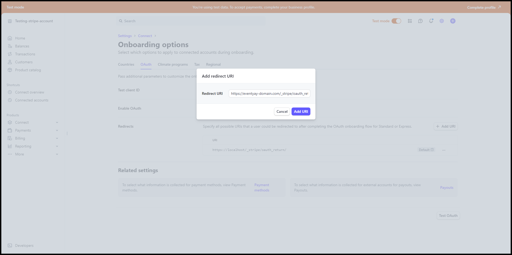
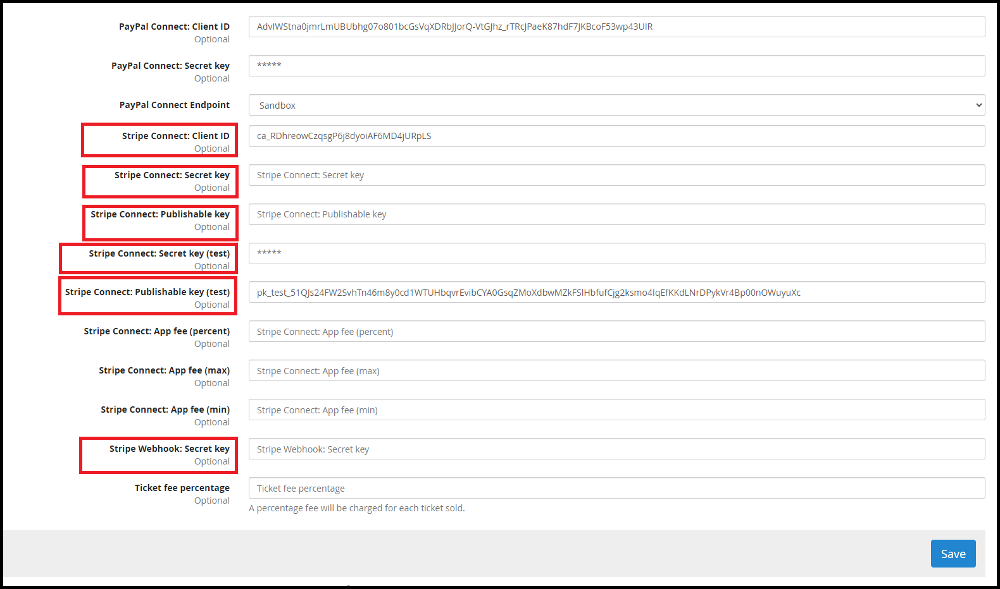

# Stripe Payment Settings Instruction

This guide will walk you through obtaining the necessary keys to integrate Stripe with your application.  To get started, you'll need an active Stripe merchant account. If you don't have one yet, you can sign up at [Stripe](http://stripe.com/).

---

## Step 1: **Configure Stripe OAuth and Retrieve Client ID**

You can refer to the [Stripe documentation](https://docs.stripe.com/connect/oauth-standard-accounts#integrating-oauth)

1. Go to [Stripe Dashboard](https://dashboard.stripe.com/).
2. Select **Settings** in the upper right corner of the Stripe dashboard
3. Select **Connect** section  in Product settings.

    

4. Click [Onboarding options](https://dashboard.stripe.com/settings/connect/onboarding-options/countries) in **Onboard connected accounts** section

    

5. In the **Oauth** tab:

    

    - Enable OAuth (if it is disabled)
    - Add URI for the Stripe OAuth flow (e.g, `https://<your-domain>/_stripe/oauth_return/`)

        

    - Copy Client ID (Test client ID if you are in test mode)

        

---

## Step 2: **Retrieve Secret Key and Publishable Key**

You can also refer to the [Stripe documentation](https://docs.stripe.com/keys) or follow the steps below:

1. Go to [Stripe Dashboard](https://dashboard.stripe.com/).
2. Log in with your credentials.
3. In the Dashboard, navigate to:
    - Click Developers in the left menu → Click **API keys**.
4. You will see two keys:
    - **Publishable Key**: Starts with `pk_`.
    - **Secret Key**: Starts with `sk_`.

    

5. Click **Reveal test key** or **Reveal live key** to see the **Secret Key** (depending on your mode):
    - **Test Mode**: For development and testing purposes.
    - **Live Mode**: For production use.

6. Copy both keys and store them securely.

---

## Step 3: **Retrieve Webhook Secret Key**

You can also refer to the [Stripe documentation](https://docs.stripe.com/webhooks) or follow the steps below:

1. In the Dashboard, go to:
    - Click Developers in the left menu → Click [Webhooks](https://dashboard.stripe.com/workbench/webhooks).
2. Click **Add destination**

    

3. Choose the event types:
    - Events from: Your account
    - API version: 2024-11-20.acacia
    - Events:
        - `charge.succeeded`
        - `charge.failed`
        - `charge.refunded`
        - `charge.updated`
        - `charge.dispute.created`
        - `charge.dispute.updated`
        - `charge.dispute.closed`
        - `source.chargeable`
        - `source.failed`
        - `source.canceled`
        - `payment_intent.succeeded`
        - `payment_intent.payment_failed`
        - `payment_intent.canceled`
        - `payment_intent.processing`
    - Click Continue button

    

4. Choose Destination type:
    - Destination type: **Webhook endpoint**
    - Click Continue

    

5. Enter the following details:

    - **Endpoint URL**: The URL in your application that will handle the webhook (e.g., `https://yourdomain.com/_stripe/webhook`).
    - **Description:** Add optional description of the destination
    - Click **Create destination**

    

6. After creating the webhook endpoint:

    

    - Click on the endpoint you just created.

    - Click **Reveal** under **Signing secret**.

7. Copy the **Signing Secret** (starts with `whsec_`).

---

## **Step 4: Add Stripe keys to Eventyay Global Settings**

1. Log in to eventyay as an admin user
2. Access to eventyay admin dashboard
3. Click to **Global settings** on the left menu

    

4. Scoll down to **Stripe settings**

    

Fill in the following fields:

- **Stripe Connect: Client ID**: `[Client ID from Step 1]`
- **Stripe Connect: Secret key**: `[Secret key from Step 2 (live mode)]`
- **Stripe Connect: Publishable key**: `[Publishable key from Step 2 (live mode)]`
- **Stripe Connect: Secret key (test)**: `[Secret key from Step 2 (test mode)]`
- **Stripe Connect: Publishable key (test)**: `[Publishable key from Step 2 (test mode)]`
- **Stripe Webhook: Secret key**: `[Webhook secret key from Step 3]`
- Click **Save**

**Note**:

1. You need to enable Stripe payment method for Stripe settings to appear in the Eventyay admin dashboard.
2. For payment, Some Stripe payment methods need to enable on [organizer’s Stripe account](https://dashboard.stripe.com/settings/payments) first before configuring them in the Eventyay system.
